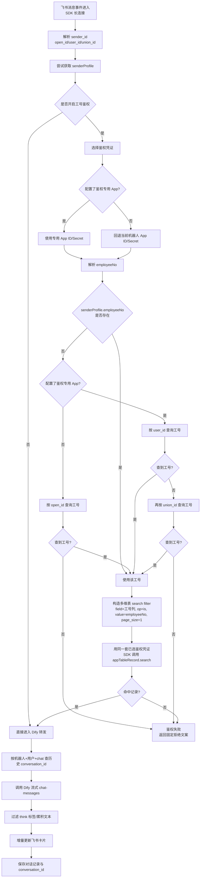

# Feishu Robot Adapter for Dify

飞书机器人与 Dify 应用对接的适配服务：通过**飞书 SDK 长连接**接收消息，调用 Dify 流式对话 API，并将回复实时更新到飞书**交互式卡片**。提供 **Web 配置台**管理多机器人、导出对话记录。

---

## 目录

- [功能概览](#功能概览)
- [技术栈](#技术栈)
- [飞书侧：创建应用与权限](#飞书侧创建应用与权限)
- [本服务中的接入方式（长连接）](#本服务中的接入方式长连接)
- [Dify 侧配置](#dify-侧配置)
- [Web 配置台使用说明](#web-配置台使用说明)
- [配置项说明（application.yml）](#配置项说明applicationyml)
- [数据存储与重启说明](#数据存储与重启说明)
- [本地运行与打包](#本地运行与打包)
- [安全建议](#安全建议)
- [常见问题](#常见问题)
- [License](#license)

---

## 功能概览


| 能力        | 说明                                                            |
| --------- | ------------------------------------------------------------- |
| 长连接收消息    | 使用飞书 `com.lark.oapi.ws.Client`，无需公网 HTTP 事件回调地址               |
| Dify 流式对话 | `POST /chat-messages`，SSE 按行解析，**每 20 字符增量更新卡片**平衡流畅度与API调用次数 |
| 多轮会话      | 按「机器人配置 + Dify 用户标识 + 飞书 chat」复用 `conversation_id`（见下文）       |
| 会话重置      | 用户发送 `/clear` 可清空当前会话上下文，下一条消息强制新会话                           |
| 用户上下文     | 可选：飞书通讯录姓名/工号/邮箱等传入 Dify `inputs`；Dify `user` 优先用工号           |
| 多模态       | 文本 / 图片 / 文件 / 富文本（post）入站；出站解析 Dify 附件并渲染卡片                  |
| 管理后台      | 登录后维护多机器人、开关长连接、导出 CSV 记录                                     |


---

## 技术栈

- Java 21、Spring Boot 3.3
- Spring Data JPA + **H2 文件库**（默认 `./data/feishu-robot-adapter`）
- 飞书 OpenAPI SDK（`oapi-sdk`）
- 前端：静态页 `login.html` / `index.html` + `styles.css` / `app.js`

---

## 飞书侧：创建应用与权限

在 [飞书开放平台](https://open.feishu.cn/) 创建**企业自建应用**（机器人能力按你实际场景开通）。

### 1. 基础凭证

- **App ID**、**App Secret**：应用详情页「凭证与基础信息」中复制，填入本服务 Web 表单。

### 2. 事件与加密（长连接场景）

本服务使用 **SDK 长连接**接收事件，**不依赖**「请求网址 URL」类 HTTP 回调；但仍建议在开放平台中：

- 按需配置 **事件订阅**中的 **Verification Token**、**Encrypt Key**（若启用加密），并与本服务表单中填写一致，供 SDK 内 `EventDispatcher` 校验/解密事件。

### 3. 权限（scope）清单

在开放平台「权限管理」中搜索并勾选；**创建版本并发布**，由**租户管理员审核**后生效。建议按最小权限从小到大使用以下三档模板。

#### 3.1 基础版：收消息 + 回复消息 + 交互式卡片

```json
{
  "scopes": {
    "tenant": [
      "im:message",
      "im:message:readonly",
      "im:message:send_as_bot",
      "im:message.p2p_msg:readonly",
      "im:message.group_at_msg:readonly",
      "im:chat.members:bot_access",
      "im:chat.access_event.bot_p2p_chat:read",
      "cardkit:card:read",
      "cardkit:card:write"
    ],
    "user": [
      "im:message",
      "im:chat.access_event.bot_p2p_chat:read"
    ]
  }
}
```

#### 3.2 增强版：在基础版上增加通讯录身份信息

```json
{
  "scopes": {
    "tenant": [
      "im:message",
      "im:message:readonly",
      "im:message:send_as_bot",
      "im:message.p2p_msg:readonly",
      "im:message.group_at_msg:readonly",
      "im:chat.members:bot_access",
      "im:chat.access_event.bot_p2p_chat:read",
      "cardkit:card:read",
      "cardkit:card:write",

      "contact:contact.base:readonly",
      "contact:user.basic_profile:readonly",
      "contact:user.email:readonly",
      "contact:user.employee_id:readonly",
      "contact:user.employee_number:read"
    ],
    "user": [
      "im:message",
      "im:chat.access_event.bot_p2p_chat:read",
      "contact:contact.base:readonly"
    ]
  }
}
```

#### 3.3 完整版：在增强版上增加多维表（Base/Bitable）

```json
{
  "scopes": {
    "tenant": [
      "im:message",
      "im:message:readonly",
      "im:message:send_as_bot",
      "im:message.p2p_msg:readonly",
      "im:message.group_at_msg:readonly",
      "im:chat.members:bot_access",
      "im:chat.access_event.bot_p2p_chat:read",
      "cardkit:card:read",
      "cardkit:card:write",

      "contact:contact.base:readonly",
      "contact:user.basic_profile:readonly",
      "contact:user.email:readonly",
      "contact:user.employee_id:readonly",
      "contact:user.employee_number:read",

      "base:record:retrieve",
      "bitable:app",
      "bitable:app:readonly"
    ],
    "user": [
      "im:message",
      "im:chat.access_event.bot_p2p_chat:read",
      "contact:contact.base:readonly"
    ]
  }
}
```

#### 3.4 说明

- 上述三档覆盖本仓库核心链路；未接入的能力（如 Aily、CoreHR、Wiki）建议不要额外开通。
- `contact:user.employee_number:read` 用于读取工号，作为 Dify `user` 与 `inputs` 时优先标识。
- 若你确实接了 Base/Bitable 接口，请使用“完整版”；否则优先“增强版”。

#### 3.5 多维表工号鉴权机制（当前实现）

- 鉴权开启后，服务会使用飞书 SDK `appTableRecord.search`，按配置的工号字段（默认 `工号`）做**服务端 filter** 精确匹配。
- 匹配条件为 `field_name = employeeField`、`operator = is`、`value = employeeNo`，并设置 `page_size=1`；只要命中 1 条记录即视为有权限。
- 若配置了 `view_id`，查询会限定在该视图范围内，便于按业务分组控制可访问人群。
- 支持配置**鉴权专用 App ID / App Secret**（可选，需成对填写）：已配置时使用该凭证访问多维表；未配置时回退复用当前机器人凭证。
- 工号解析规则：
  - 未配置鉴权专用应用：`senderProfile.employeeNo` 为空时，仅用 `open_id` 查询通讯录工号。
  - 已配置鉴权专用应用：`senderProfile.employeeNo` 为空时，按 `user_id -> union_id` 依次查询通讯录工号（避免跨应用 `open_id` 问题）。
- 鉴权通过后，若鉴权阶段解析到了工号，会在本次转发中回填到发送者上下文，确保 Dify `user` 和 `inputs.employee_no` 优先复用同一工号，避免后续按业务应用 `open_id` 再查失败导致标识漂移。
- 不再采用“拉取多页记录后本地遍历”的方式，避免全表扫描带来的延迟与配额开销。
- 参考文档：
  - [记录筛选参数填写说明](https://open.feishu.cn/document/docs/bitable-v1/app-table-record/record-filter-guide)
  - [获取多维表格元数据](https://open.feishu.cn/document/server-docs/docs/bitable-v1/app/get?appId=cli_REDACTED_APP_ID)

#### 3.6 影响范围说明（是否影响其他机器人）

- **不会全局影响所有机器人**：鉴权逻辑始终按「当前这条机器人配置」读取参数执行（按 `bot_config_id` 隔离）。
- 若某机器人**未开启工号鉴权**，其行为与之前一致：直接进入 Dify 转发流程，不经过多维表鉴权。
- 若某机器人开启了工号鉴权但**未配置鉴权专用 App ID/Secret**，会自动回退使用该机器人自身 App 凭证。
- 若某机器人配置了**鉴权专用 App ID/Secret**，仅该机器人在“查工号 + 查多维表”时使用专用凭证，不会改变其它机器人。
- 工号补查与多维表 `search filter` 仅在“工号鉴权开启”分支生效；且会根据是否配置专用鉴权应用选择不同工号查询路径。

**user** 侧 scope 为「用户身份」授权场景下使用；与 **tenant** 侧配合以控制台实际要求为准。

同时需在**管理后台**将应用授权到**可见的部门/人员范围**，否则会出现「通讯录拉取失败、仅有群聊 @ 展示名」等情况。

### 4. 将机器人用于群聊 / 单聊

- 在飞书客户端将应用机器人**拉入群**或**单聊**，用户向机器人发消息或 @ 机器人，事件才会到达本服务。

---

## 本服务中的接入方式（长连接）

- 在 Web 配置台为某条机器人配置开启 **「长连接」** 后，进程内会创建 `com.lark.oapi.ws.Client` 并 `start()`。
- 应用**重启**后，若数据库中该配置 `longConnectionEnabled = true`，启动逻辑会尝试**自动恢复**长连接（具体见 `LongConnectionStartupInitializer`）。
- 关闭长连接会断开 WebSocket（实现上通过反射调用 SDK 内 `disconnect` 等，见 `InMemoryFeishuLongConnectionManager`）。
- **连接与线程模型：** 每一条开启长连接的机器人配置在进程内各占**独立的** SDK 长连接（`InMemoryFeishuLongConnectionManager` 按 `configId` 维护多个 `Client`），并非「全局长连接单线程共用一条 WS」。下游处理消息时使用**共用线程池**异步执行（见 `MessageRelayServiceImpl`），因此也不是「整机房所有机器人只占一个线程」。
- **`message_id` 去重与同一条 `@` 多个机器人：** 转发时用飞书消息的 **`message_id` 做一次去重**（避免重复投递时重复问答）。群内**在同一条气泡里 `@` 多个已接入本服务的机器人**时，各机器人收到的 `im.message.receive_v1` 往往仍对应**相同的 `message_id`**，最先通过去重的那个实例会继续走 Dify，其余会看到「消息已处理，跳过」而**不会再回复**。若需要每个机器人各答一轮，请**分多条消息**分别 `@`，或单次只 `@` 一个机器人。

---

## Dify 侧配置

### Base URL 与 API Key

- **Dify Base URL**：可填根地址或带 `/v1` 的地址，服务内会规范化后请求 `/chat-messages`、`/files/upload`。
- **API Key**：在 Dify 应用内创建，填入 Web 表单。

### 多轮对话（conversation）

- 本服务会把上一次成功返回的 **`conversation_id`** 与 **`user`** 一并持久化，下次同用户、同群继续传参给 Dify。
- **`user`** 标识规则：若飞书通讯录能取到 **工号**，则优先用工号作为 Dify 的 `user`；否则使用 `open_id`，再否则 `union_id`。上传文件接口使用同一 `user`，以与对话一致。
- 用户发送 **`/clear`** 时，会清空当前「机器人 + 用户 + chat」下已保存的 `conversation_id`，并回复提示“下一条消息将开启新会话”。

### `<think>` 兼容处理

- 对于未开启“推理分离”或会输出推理标签的模型，本服务会在流式阶段过滤 `<think>...</think>` 段，仅把可见回答发给飞书卡片。
- 过滤器支持标签跨 chunk 断裂场景（例如 `<thi` + `nk>`）。

### 传入 Dify 的 `inputs` 变量（可选）

在 Dify 应用里添加**同名输入变量**后，可在提示词或工作流中引用（语法以你使用的 Dify 版本为准）：


| 变量名                  | 含义          |
| -------------------- | ----------- |
| `feishu_sender_name` | 展示名         |
| `feishu_full_name`   | 通讯录姓名       |
| `feishu_employee_no` | 工号          |
| `feishu_email`       | 邮箱          |
| `feishu_en_name`     | 英文名         |
| `feishu_union_id`    | 飞书 union_id |


未开通通讯录权限时，部分字段可能为空。

配置台支持「Dify input 映射表」动态添加多行，每行可配置：

- Dify 变量名（如 `user_name`）
- 来源字段（展示名/工号/姓名/邮箱/英文名）

---

## Web 配置台使用说明

### 1. 访问与登录

1. 浏览器访问：`http://<服务器>:8081`（默认端口 `8081`）。
2. 未登录会进入登录页；默认管理员账号：
  - 用户名：`admin`
  - 密码：`admin123`
   **生产环境部署前务必修改默认密码**！

### 2. 添加机器人配置

登录后点击 **「添加配置」**，在弹窗中填写：


| 区块   | 字段                               | 说明                         |
| ---- | -------------------------------- | -------------------------- |
| 基础信息 | 机器人名称                            | 仅用于本后台展示                   |
| 飞书接入 | App ID / App Secret              | 开放平台应用凭证                   |
| 飞书接入 | Verification Token / Encrypt Key | 与事件订阅配置一致；不用加密可留空（视开放平台设置） |
| Dify | Base URL                         | 你的 Dify 服务地址               |
| Dify | API Key                          | 应用 API Key                 |


提交成功后，列表中会出现对应卡片。

### 3. 开启长连接

在卡片上操作 **开启长连接**（具体按钮文案以页面为准）。开启成功后，飞书消息才会进入本服务并转发 Dify。

### 4. 对话记录与导出

- 后台会保存问答记录（含 OpenId、Dify 用户标识、chat、Dify 会话 id 等）。
- 使用 **导出记录**（若已提供）可下载 CSV，便于审计。

### 5. 会话重置指令

- 在飞书里发送：`/clear`（群聊可 `@机器人 /clear`，会识别并剥离 @ 前缀）
- 作用：清空当前会话上下文（仅当前机器人 + 当前用户 + 当前 chat）
- 结果：机器人会回复确认文案，下一条消息从新会话开始

---

## 配置项说明（`application.yml`）


| 配置                                | 说明                                                  |
| --------------------------------- | --------------------------------------------------- |
| `server.port`                     | HTTP 端口，默认 `8081`                                   |
| `spring.datasource.url`           | H2 文件库路径；**相对路径相对进程工作目录**，换目录启动会换库，生产建议改为**固定绝对路径** |
| `app.auth.default-admin-username` | 默认管理员用户名，默认 `admin`                                 |
| `app.auth.default-admin-password` | 默认管理员密码，默认 `admin123`，**部署前请修改**                    |


可通过 `application-local.yml`（已加入 `.gitignore`）覆盖本地配置。

---

## 数据存储与重启说明

- 对话与机器人配置保存在 **H2 文件库**（默认 `./data/` 下，且已在 `.gitignore` 中忽略，**勿将业务库提交 Git**）。
- 进程重启后，只要**库文件路径不变**，Dify 多轮会话与配置仍在；启动时会尝试回填历史行的 `dify_user_key`，避免升级后续聊丢失（见 `ConversationRecordBackfillRunner`）。

---

## 本地运行与打包

```bash
mvn clean package -DskipTests
java -jar target/feishu-robot-adapter-*.jar
```

开发时：

```bash
mvn spring-boot:run
```

健康检查（若已暴露）：`GET /api/health`（以实际 `HealthController` 为准）。

---

## 安全建议

1. **修改默认管理员密码**，并限制管理后台访问 IP 或前置网关鉴权。
2. **勿**将真实 `App Secret`、Dify Key 提交到公开仓库；生产用环境变量或密钥管理。
3. H2 默认无密码，**不要**把数据库文件暴露到公网目录。
4. 飞书、Dify 的权限与令牌遵循各自平台最小权限原则。

---

## 常见问题

**Q：收不到飞书消息？**  
检查：机器人是否入群/单聊、长连接是否已开启、应用权限与版本是否已发布并通过审核。

**Q：Dify 多轮对话断了？**  
检查：是否更换了进程工作目录导致 H2 路径变化；`user` 是否从 open_id 切换为工号（切换后 Dify 侧为新用户会话）。

**Q：拿不到用户姓名/工号？**  
检查通讯录权限与可见范围；群聊仅 @ 机器人时可能没有发送者 mentions，需依赖通讯录接口。

**Q：`Missing artifact fastjson`？**  
本仓库**不依赖** Fastjson，JSON 使用 Jackson；若本地 `pom.xml` 误加错误坐标的依赖，请删除或改为 `com.alibaba:fastjson` 正确 GAV。

**Q：为什么日志里会看到大量卡片更新性能日志？**  
这是新增的排查日志（`[MessageRelay][Perf]` / `[Dify][Perf]`），用于定位慢点。若生产环境不需要，可将日志级别调高或按需去掉。

---

## 工作流程（简图）

```
飞书消息 → SDK 长连接 → 解析消息/附件 → Dify 流式 API
         → 更新飞书卡片 ← 累积文本与附件展示
```

### 鉴权 + 转发流程（详细）



---

## License

MIT